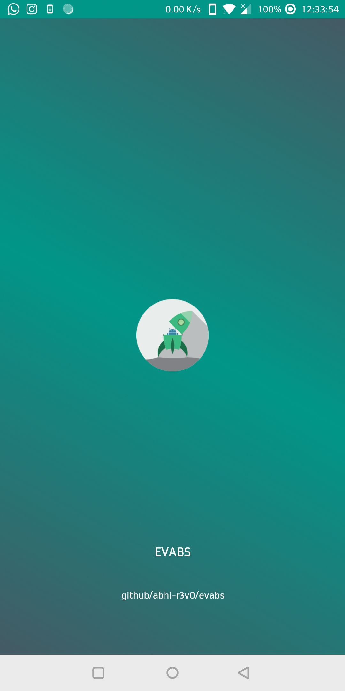
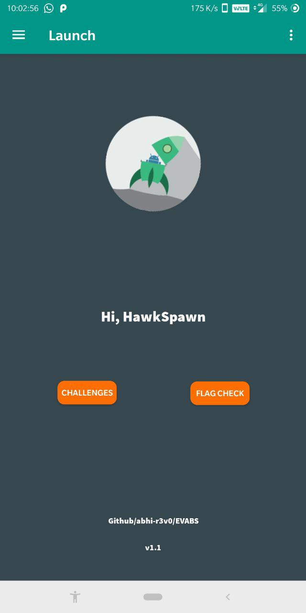
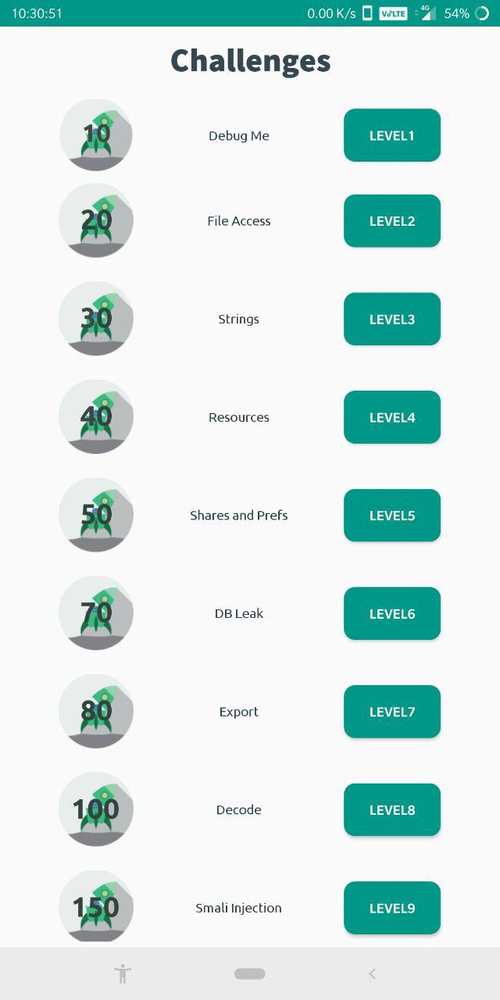
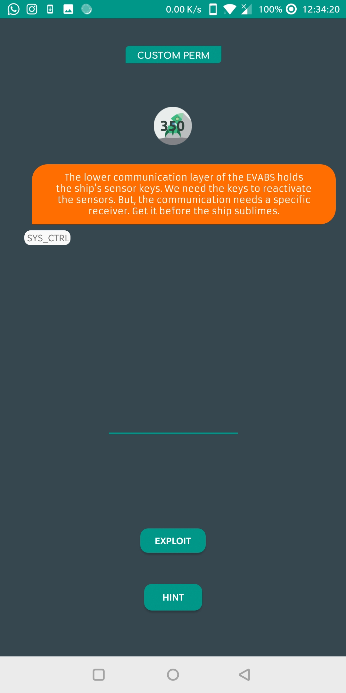
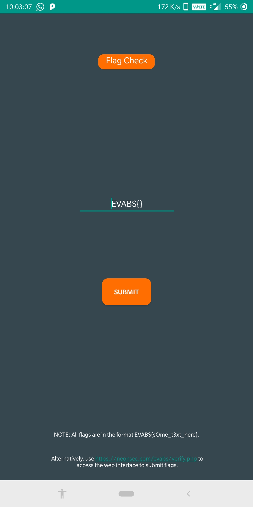

# EVABS (Extremely Vulnerable Android Labs)

---

 [](https://www.github.com/abhi-r3v0/EVABS)  [](https://www.github.com/abhi-r3v0/EVABS) 


An open source Android application that is intentionally vulnerable so as to act as a learning platform for Android application security beginners. The effort is to introduce beginners with very limited or zero knowledge to some of the major and commonly found real-world based Android application vulnerabilities in a story-based, interactive model. EVABS follows a level-wise difficulty approach and in each level, the player learns a new concept. This project is still under progress and aims at incorporating as many levels as possible.

For complete details and solutions, head to the [blog series](https://www.hawkspawn.com/blog/getting-started-with-evabs/).

---

### INSTALLATION

* Download the latest application file from the [releases](https://github.com/abhi-r3v0/EVABS/releases) page.
* Install it in an Android device (rooted recommended) or emulator. 
(Head to this [blog](https://www.hawkspawn.com/blog/getting-started-with-evabs/) for more information)

---

### SCREENSHOTS:










---

### REQUIREMENTS

* Android Emulator (Default/Genymotion) or a rooted Android device.
* [FRIDA](https://frida.re/)
* [ADB](https://www.xda-developers.com/install-adb-windows-macos-linux/)
* [apktool](https://ibotpeaches.github.io/Apktool/)
* [dex2jar](https://github.com/pxb1988/dex2jar)

or use [ADHRIT](https://github.com/abhi-r3v0/Adhrit) (all-in-one tool)

Confused? Read the [documentation](https://github.com/abhi-r3v0/EVABS/wiki/Getting-Started-With-EVABS) on setting up the environment.

---

### CHANGE LOG

* Flag checking module added within EVABS.
* Alternatively, you can use this [link](https://www.neoonsec.com/evabs/verify.php) to submit flags from your browser.
* UI improvements

### BUILDING LOCALLY

* Clone the repository ```git clone https://github.com/abhi-r3v0/EVABS.git``` or download the zip.
* Create a new folder ```EVABS``` in your ```AndroidStudioProjects``` directory and move the contents to the new directory.
* Fire up Android Studio, ```File``` -> ```open``` and select the project.
* Go to ```Build``` -> ```Generate Signed APK```.
* Create a new signature, if it doesn't exist. Sign the APK.
* Install the APK using ```adb install EVABS.apk```

---

## THE SQUAD

#### PROJECT LEAD:

* Abhishek J M (jmabhishek4@gmail.com, [@HawkSpawn](https://www.hawkspawn.com/))

#### LOGO

* Loyd Jayme (loydjayme1996@gmail.com, [@loydjayme25](https://github.com/loydjayme25))

---


